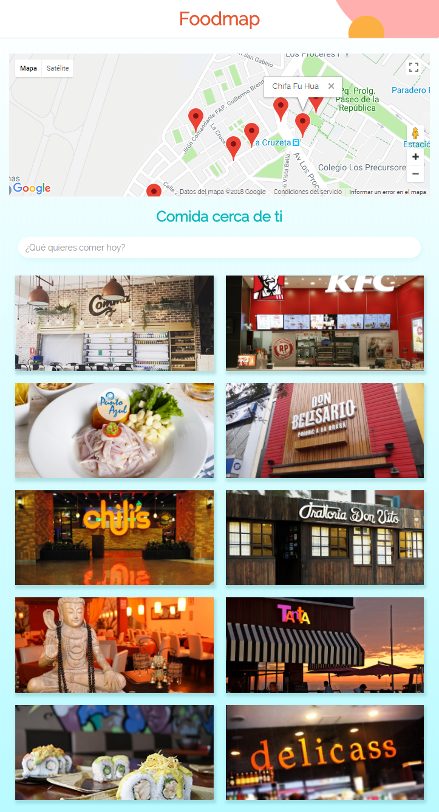
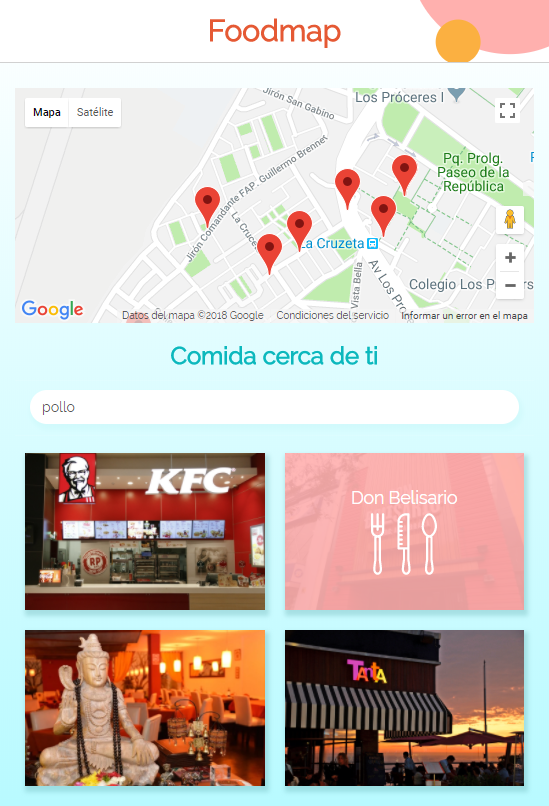
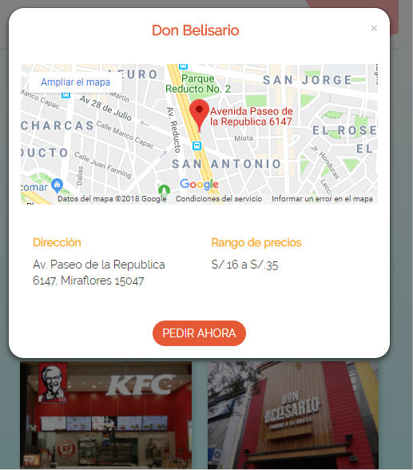

# Foodmap

Foodmap es un aplicativo que localiza los restaurantes cercanos y los muestra en Google Maps. Además cuenta con una data local de restaurantes con información relevante como dirección, precios y comida que ofrece.

## Desarrollo

El objetivo de este reto es desarrollar una web-app que contenga un filtro para restaurantes.

La aplicación fue desarrollada utilizando una data para la información de los restaurantes, Bootrstrap y jQuery.

## Flujo de aplicación

La pantalla principal de la aplicación muestra un filtro de búsqueda y las opciones de restaurantes.

Las palabras que se ingresen el filtro de búsqueda serán comparadas con la comida que se ofrece en cada restaurante o con el nombre de este, según la data local de la que se dispone.

Al hacer click en las miniaturas, aparece un modal que muestra la información de cada restaurante, así como su ubicación en el mapa.

